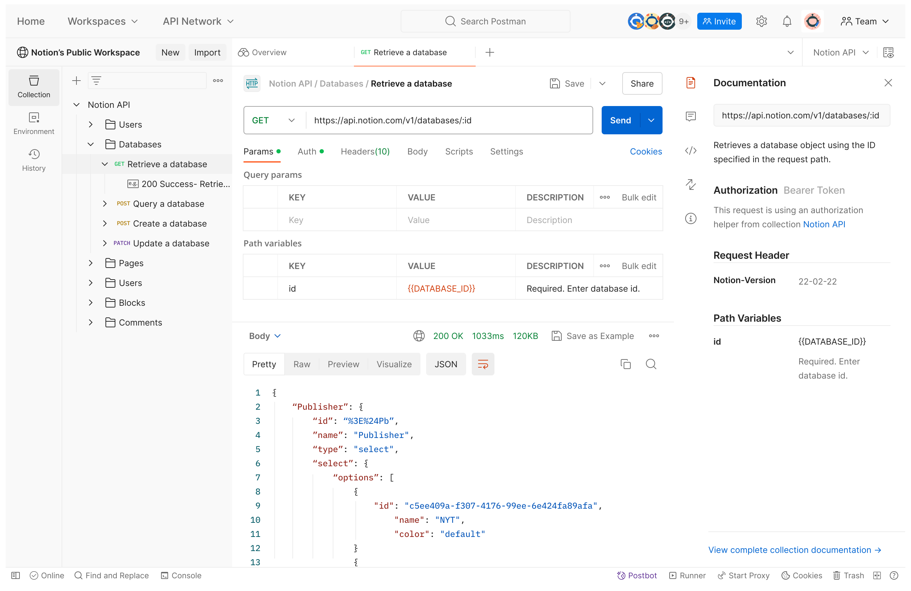

# API Introduction

**A**pplication
**P**rogramming
**I**nterface

An api is an interface to obtain data from a service.

```
.--------.            ____          .-.     .-.      __________
|        |        ___/    \__      /  |     |  \    |__________|
'========'    ___/           \    |   |=====|   |-->|          |
|   DB   |---/      Server    |---|   | API |   |   |  Client  |
'========'   \_______________/    |   |=====|   |<--|          |
|        |                         \  |     |  /    '__________'
'--------'                          '-'     '-'     
```

## Communication

### Request and Response Cycle

Describes how you interact with an API.

1. Make a request for specific data.
2. The API sends you what you asked for.

### JSON

Data formatted as a javascript object. Made up of key value pairs.

## Connecting to an API

::: columns
:::: column

### Postman

Graphical app to connect and make request to APIs.



::::
:::: column

### JavaScript

#### Fetch

```javascript
fetch('https://domain/api/endpoint')
.then(
    function(response) {
        return response.json();
    }
)
.then(
    function(respData) {
        doSomething(respData);
    }
)
```

::::
:::

## Using APIs

::: columns
:::: column

### Endpoints

Specific data options from the API.

`domain/api/endpoint`

::::
:::: column

### Parameters

Define or filter response from API.

`domain/api/endpoint?par1=val1&par2=val2`

::::
:::

## Status Codes

::: columns
:::: column

- 1xx: Information
- 2xx: Success
- 3xx: Redirect
- 4xx: Client Error
- 5xx: Server Error

::::
:::: column

### Error Handling

```javascript
fetch('https://domain/api/endpoint')
.then(
    function(response) {
        if (response.status == 200) {
            reutrn response.json();
        } else {
            errHandler();
        }
    }
)
``` 

::::
:::

# Documentation

::: columns
:::: column

- Simple Language.
- Well Organized.
- Autogenerated.
- Interactive.

::::
:::: column

### Tools

- Swagger
- Postman
- Confluence

::::
:::

## Components

::: columns
:::: column

### Name

- Meaningful.
- Purpose of the API.

### Description

- Not technical.
- Business use case.

### Endpoint

- Used for communication.
- Every touchpoint in the communication channel is and endpoint.

### Authorization

- No authentication.
- Username and password.
- Secure toke.
- OAUTH.

::::
:::: column

### Parameters

- Variable part of the resource.
- Name, value and description.
- Required or optional.

### Headers

- Metadata about our request.
- Name, value and description.
- Required or optional.

### Request and Response Body

- Description of attributes.
- Example.
- Success and Error Codes.

::::
:::

# REST API

Representational State Transfer (REST) refers to a group of
software architecture design constraints that bring about efficient,
reliable, and scalable system.

## REST Constraints

::: columns
:::: column

### Client-server Architecture

Client manages user interface concerns while the server manages data
storage concerns.

### Statelessness

No client context or information can be stored on the server between
requests.

### Cacheability

All REST responses must be clearly marked as cacheable or not
cacheable.

::::
:::: column

### Layered System

The client cannot know, and shouldn't care, whether it's connected
directly to the server or to an intermediary.

### Code on Demand

Servers are allowed to transfer executable code like javascript and
compiled components to clients.

::::
:::

---

### Uniform Interface

::: columns
:::: column

#### Resource identification in request

The URI request must specify what resource it is looking for and what
format the response should use.

#### Resource manipulation through representations

Once a client has a representation of a resource, it can modify or
delete the resource.

::::
:::: column

#### Self-descriptive messages
 
Each representation must describe its own data format.

#### Hypermedia as the engine of application

Once a client has access to a REST service, it should be able to
discover all available resources and methods through the hyperlinks
provided.

::::
:::

## RESTful

A REST service running on the web over HTTP.

## Request

### Anatomy

::: columns
:::: {.column width=60%}

#### Methods

::: columns
:::: column

##### GET

Get specified resource.

##### POST

Create a new resource.

##### PUT 

Update existing singleton resource based on ID.

##### PATCH

Modify existing singleton resource based on ID.

::::
:::: column

##### DELETE

Delete singleton resource based on ID.

##### OPTIONS

Get the options available from this resource.

##### HEAD

Get just response headers from resource.

::::
:::

::::
:::: {.column width=35%}

#### URI

Points to the resource we want to interact with.

#### Metadata

Include content type, authentication, cache control and more.

::::
:::

---

### Discovery

You can use GET and OPTION methods to get documentation from the API.

### Resource

Abstraction of information. Conceptual mapping to a set of entities.

- Collection
- Singleton

### Representation

Creates a unique representation that can be modified to fit
specification.

## Response

### Header

Contains protocol, status message and metadata.

#### Status Messages

##### 1xx Information

Rarely used.

::: columns
:::: {.column width=16%}

##### 2xx Success

| 2xx | Success    |
| --- | ---------- |
| 200 | OK         |
| 201 | Created    |
| 202 | Accepted   |
| 204 | No content |

::::
:::: {.column width=28%}

##### 3xx Redirection

| 2xx | Redirection             |
| --- | ----------------------- |
| 301 | Moved permanently       |
| 302 | Moved Temporarily       |
| 303 | Found at this other URL |
| 307 | Temporary redirect      |
| 308 | Resume incomplete       |

::::
:::: {.column width=24%}

##### 4xx Client Error

| 4xx | Client error       |
| --- | ------------------ |
| 400 | Bad request        |
| 401 | Unauthorized       |
| 403 | Forbidden          |
| 404 | No content         |
| 405 | Method not allowed |

::::
:::: {.column width=23%}

##### 5xx Server Error

| 5xx | Success               |
| --- | --------------------- |
| 500 | Internal server error |
| 502 | Bad gateway           |
| 503 | Service unavailable   |

::::
:::

# Design

## Adding an API

::: columns
:::: {.column width=30%}

### Bolt-On

For existing systems.

- Brute-force approach.
- Fastest way to build something useful.
- **Benefit:** takes advantage of existing code and systems.
- **Drawback:** problems in the application or architecture leak
  through into the API.

::::
:::: {.column width=30%}

### Greenfield

For new systems.

- API or mobile-first mindset
- **Benefit:** takes advantage of new technologies and architectures.
- **Drawback:** often requires massive upfront investment.

::::
:::: {.column width=30%}

### Facade

Replacing piece by piece.

- **Benefit:** ideal for legacy systems.
- **Drawback:** hard to replicate behavior for a full one-on-one
  conversion.

::::
:::

## Modeling

::: columns
:::: column

### Identify Participants

Entities who will use the API.

#### Info

- Name and role.
- Internal or external.
- Active or passive.

### Identify Activities

Describe activities participants undertake.

### Break Into Steps

- References individual participants and their interactions.
- Specifies order and dependencies.

::::
:::: column

### Create API Definitions

- Define resources (Anything users interact with).
- Map activities to methods.
- Define relationship (independent, dependent, associative).

### Validating API

- Solving use cases with steps defined.
- Use microfrmework to validate methods and URL patterns.
- Write simple documentation.

::::
:::

## Design Practices

::: columns
:::: column

### Authentication and Authorization

#### API Keys

- Easy to add to header or URL.
- Framework and programming language agnostic.
- URLs are not secret.
- Difficult to update/rotate if compromised.

#### OAuth

- Reliable and well established.
- Massive ecosystem.
- Open-source and commercial options.
- Complicated
- Initial implementation is time consuming.

### Versioning

- Header
- URL

::::
:::: column

### Media Types

#### Collection+JSON

For groups or collections of resources.

#### Hypertext Application Language (HAL)

Separate payload into `data` and `_links`.

### ETags Request and Response

1. Client makes a request.
2. Server responds and creates an ETag based on the resource state.
3. Client makes a HEAD request (same request as before).
4. If data is unchanged, server returns the same ETag.
5. If data has changed, server return new ETag.
6. If ETag is changed, the client makes full request.

::::
:::

# Swagger

## Swagger Ecosystem

::: columns
:::: column

### Swagger vs OpenAPI

#### Swagger

- Design, document, and generate code for APIs.
- Produce OAS compliant API definitions.
- Can also build SDKs.

#### OpenAPI

- Standard format for using metadata for RESTful services.
- Metadata is machine readable.

::::
:::: column

### Tools

#### Swagger Editor

Create OpenAPI definitions.

#### Swagger UI

Generate docs from API definitions.

#### Swagger Codegen

Build client SDKs from API definitions.

### OpenAPI Specification

Standard interface description for REST APIs.

::::
:::

---

#### Example

```yaml
openapi: <openapi-version>
info:
  title: <api-name>
  version: <api-version>
paths:
  /<endoint>:
    <method>:
      response:
        <code>:
          description: <description>
          content:
            <media-type>:
              schema:
                type: <type>
                items:
                  properties:
                    <key>:
                      type: <type>
                      example: <val>
```

## API Specifications

### Definitions

::: columns
:::: column

#### Info

Metadata about the API.

#### Servers

Different servers hosting API implementation.
 
#### Security

Type of security scheme used.

#### Paths

API endpoints and operations.

::::
:::: column

#### Tags

Group API operations.

#### Externaldocs

External resources.

#### Components

Reusable object and schemas.

::::
:::

## Parameters

::: columns
:::: {.column width=30%}

### Query Parameters

```yaml
paths:
  /endpoint:
    <method>:
      parameters:
        - in: query
          name: <param>
          description: <description>
          required: <false/true>
          schema:
            type: <type>
            example: <arg>
      response:
        ...
```

::::
:::: {.column width=30%}

### Template Parameters in Paths

```yaml
paths:
  /endpoint/{id}:
    <method>:
      partameters:
        - in: path
          name: id
          required: true
          schema:
            type: <type>
            example: <val>
      response:
        ...
```

::::
:::: {.column width=30%}

### Headers

```yaml
paths:
  /endpoint:
    <method>:
      partameters:
        - in: header
          name: <header>
          required: <false/true>
          schema:
            type: <type>
            example: <val>
      response:
        ...
```

::::
:::

## Request Body

###
```yaml
paths:
  /endpoint:
    <method>:
      requestBody:
        content:
          <media-type>:
            schema:
              type: object
              properties:
              <key>:
                type: <type>
                example: <val>
      response:
        ...
```

## Components

###
```yaml
$ref: '#/components/schemas/<schema>'
```

::: columns
:::: {.column width=30%}

### Schemas

```yaml
components:
  schemas:
    <schema>:
      type: object
      required:
        - <key>
      properties:
        <key>:
          type: <type>
          example: <val>
```

::::
:::: {.column width=30%}

### Responses

```yaml
components:
  responses:
    <response>:
      description: <description>
      content:
        <media-type>:
          schema:
            type: object
            properties:
              statusCode:
                type: string
                example: <code>
              message:
                type:string
                exapmle: <msg>
```

::::
:::: {.column width=30%}

### Parameters

```yaml
components:
  parameters:
    <param>:
      in: query
      name: <param>
      description: <description>
      required: <false/true>
      schema:
        type: <type>
        example: <arg>
  response:
    ...
```

::::
:::

## Content Negotiation

###
```yaml
response:
  <method>:
    description: <description>
    content:
      <media-type1>:
        schema:
          $ref: '#/componets/schemas/<schema>'
      <media-type2>:
        schema:
          $ref: '#/componets/schemas/<schema>'
```

# Testing and Validation

## Behavioral Testing

- Collections of functions, methods, and components
- End to end from the consumer's perspective
- Need the underlying capabilities

## Testing Practices

::: columns
:::: {.column width=22%}

### Authorization

Load at runtime from environment.

::::
:::: {.column width=22%}

### System State

Manage system state and undo changes after testing.

::::
:::: {.column width=22%}

### Prioritizing Endpoints

- User's most important tasks.
- Parts that change the most.
- Riskiest parts.

::::
:::: {.column width=22%}

### Structure

- Separate by area/endpoint.
- Separate by workflow.

::::
:::

## Gherkin

Language-agnostic syntax for describing behavior.

::: columns
:::: column

### Parts of a Test

- Feature
- Scenario
- Given
- When
- Then

::::
:::: column

####
```gherkin
Feature: <feature>

    Scenario: <scenario>

        Given <initial-condition>
	When <action>
	Then <result>
```

::::
:::
